# TaskFlow — Architecture

TaskFlow is the flagship sample for **redux-kotlin-bundle**: a Compose-Multiplatform
Kanban app (Android / iOS / Web-wasmJs / JVM-desktop) that showcases the bundle's
concurrent ModelState store, the routing-DSL reducer model, render-isolation Compose
bindings, and an offline-first sync layer.

This document describes the architecture as it exists in `examples/taskflow/`. Diagrams
are Mermaid; component references use `path:line` so they stay clickable. Paths are
relative to
`composeApp/src/commonMain/kotlin/org/reduxkotlin/sample/taskflow/`.

> **Note on packaging:** the source tree is organized **package-by-feature** over a shared
> **domain kernel**. The seven feature packages (`feature/board`, `feature/boardlist`,
> `feature/undo`, `feature/activity`, `feature/collaborators`, `feature/account`,
> `feature/settings`) each own their full vertical slice (slot models · reducers ·
> effects/middleware · actions · selectors · UI). Cross-cutting homes are `core/` (the
> domain kernel), `infra/` (DB · data · sync · platform shims), `ui/` (theme + shared
> widgets + UI shims), and `app/` (the composition root: store factories, nav, the `App()`
> shell). See [§4 Module & dependency graph](#4-module--dependency-graph) and
> [§5 Layered architecture](#5-layered-architecture).

> **Note on navigation:** the navigation layer was recently refactored from a flat
> `NavModel(route, openCardId, composing)` to a **Route stack** (`NavModel(stack)`).
> This document describes the current stack model. See [§9 Navigation](#9-navigation).

---

## Table of contents

1. [TL;DR / mental model](#1-tldr--mental-model)
2. [Tech stack](#2-tech-stack)
3. [System context](#3-system-context)
4. [Module & dependency graph](#4-module--dependency-graph)
5. [Layered architecture](#5-layered-architecture)
6. [Store topology (two layers)](#6-store-topology-two-layers)
7. [State model catalog](#7-state-model-catalog)
8. [Actions, reducers & the routing DSL](#8-actions-reducers--the-routing-dsl)
9. [Navigation](#9-navigation)
10. [Middleware pipeline & the optimistic dance](#10-middleware-pipeline--the-optimistic-dance)
11. [Data, sync & persistence](#11-data-sync--persistence)
12. [The bot collaborator](#12-the-bot-collaborator)
13. [UI / Compose binding & render isolation](#13-ui--compose-binding--render-isolation)
14. [**Threading & concurrency model**](#14-threading--concurrency-model)
15. [Platform shims (expect/actual)](#15-platform-shims-expectactual)
16. [App bootstrap sequence](#16-app-bootstrap-sequence)
17. [Design rules](#17-design-rules)
18. [Testing strategy](#18-testing-strategy)

---

## 1. TL;DR / mental model

- **Two stores.** A single **root** store holds cross-account state (the account
  directory, app settings, login flow). Each logged-in account gets its **own**
  isolated store holding that account's board state. An `AccountRegistry` owns the
  per-account stores and their background coroutines.
- **Both stores are `ModelState` stores** — a typesafe heterogeneous bag of immutable
  "models", each a slot with its own pure reducer, wired via the routing DSL
  `model(initial){ on<Action>{ s, a -> reducer(s, a) } }`.
- **Both stores are concurrent** (`CallerSerializedStore`): writes are serialized by a
  reentrant lock on the caller's thread; reads are lock-free. Subscriber callbacks are
  **marshalled to the UI main thread** by a per-platform `NotificationContext`.
- **Offline-first.** Every card mutation writes the local SQLDelight DB immediately
  (optimistic), enqueues a serializable `SyncOp` carrying its own inverse, and kicks a
  `SyncEngine` that drains the queue against a replaceable `RemoteApi` (the in-repo
  `FakeRemoteApi`). On rejection the per-op inverse reverts exactly that op.
- **Side effects live in one place** — `effectsMiddleware`
  (`feature/board/EffectsMiddleware.kt`), the only code that turns dispatched intent into
  repository calls and folds sync results back into the store.
- **The UI never reads the store wholesale.** Each column/card subscribes to the
  smallest slice it needs through `selectorState{}` / `fieldStateOf()`, so moving one
  card recomposes only the two affected columns ("Rule C").

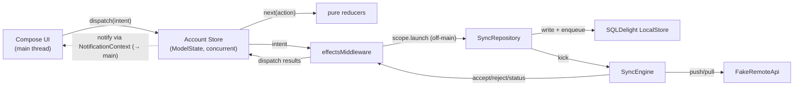

---

## 2. Tech stack

| Concern | Choice | Version |
|---|---|---|
| Language | Kotlin Multiplatform | 2.3.20 |
| UI | Compose Multiplatform (Material 3) | 1.11.0 |
| State | redux-kotlin-bundle-compose (this repo) | local project |
| Persistence | SQLDelight (`generateAsync=true`) | 2.3.2 |
| Serialization | kotlinx-serialization-json (sync ops) | 1.7.3 |
| Concurrency | kotlinx-coroutines-core | 1.10.2 |
| Immutability | kotlinx-collections-immutable | 0.5.0-beta01 |
| Time | kotlinx-datetime (`kotlin.time.Instant`) | 0.7.1 |
| Images | Coil 3 (+ coil-network-ktor3) | 3.2.0 |
| HTTP (images) | Ktor client engines | 3.1.0 |
| Markdown | mikepenz markdown-renderer (m3 + coil3) | 0.41.0 |
| Android | AGP `com.android.application`, compileSdk/targetSdk 36, minSdk 24, Java 21 | — |

**KMP targets** (`composeApp/build.gradle.kts`): `jvm`, `wasmJs` (browser executable),
`iosArm64`, `iosSimulatorArm64`, and a **conditional** `android` KMP-library target
(wired only when an Android SDK is detected). `iosX64` is intentionally dropped (removed
in Compose 1.11.0). The module applies the repo's `convention.control` plugin, which
host-gates native compilation (iOS targets only build on macOS; jvm/js/wasm/android
build everywhere).

---

## 3. System context

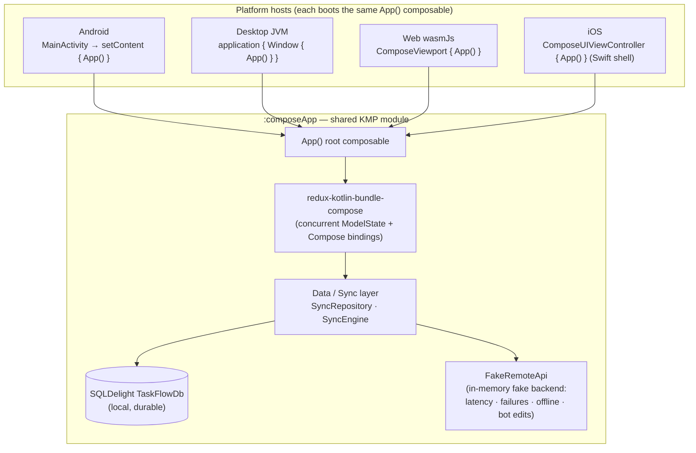

The "backend" is entirely in-process: `FakeRemoteApi` simulates latency, transient
failures, offline mode, WIP-limit rejections, and a background collaborator. There is no
real network. The persistence layer (SQLDelight) is the durable source of truth and is
**separate** from the network layer.

---

## 4. Module & dependency graph

TaskFlow is still **one** Gradle module (`:examples:taskflow:composeApp`) depending on a
**single** redux artifact; everything else is transitive. Inside that module the source is
split into feature packages over a shared `core` kernel.

### Gradle / artifact graph

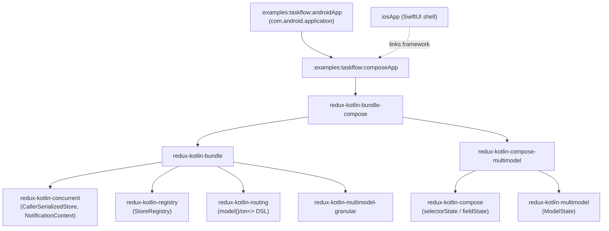

- The app imports `createConcurrentModelStore` from `org.reduxkotlin.bundle`,
  `NotificationContext` from `org.reduxkotlin.concurrent`, and Compose bindings from
  `org.reduxkotlin.compose.*`. It uses **redux-kotlin-concurrent** (not -threadsafe).
- `:androidApp` is `include()`d in `settings.gradle.kts` only when an Android SDK is
  present; the `composeApp` android target is likewise conditional.
- `iosApp/` is a Swift shell (`iOSApp.swift` + `ContentView.swift`); the Xcode project is
  a documented manual follow-up. Gradle only gates the framework link.

### Internal package graph (package-by-feature)

One module, many packages. Dependency direction flows **inward to the kernel**:
`core ← infra`, then `core` / `infra` / `ui` ← every `feature/*`, and `app` is the
**composition root** that wires everything (it is the only package allowed to know all
features and both store factories).

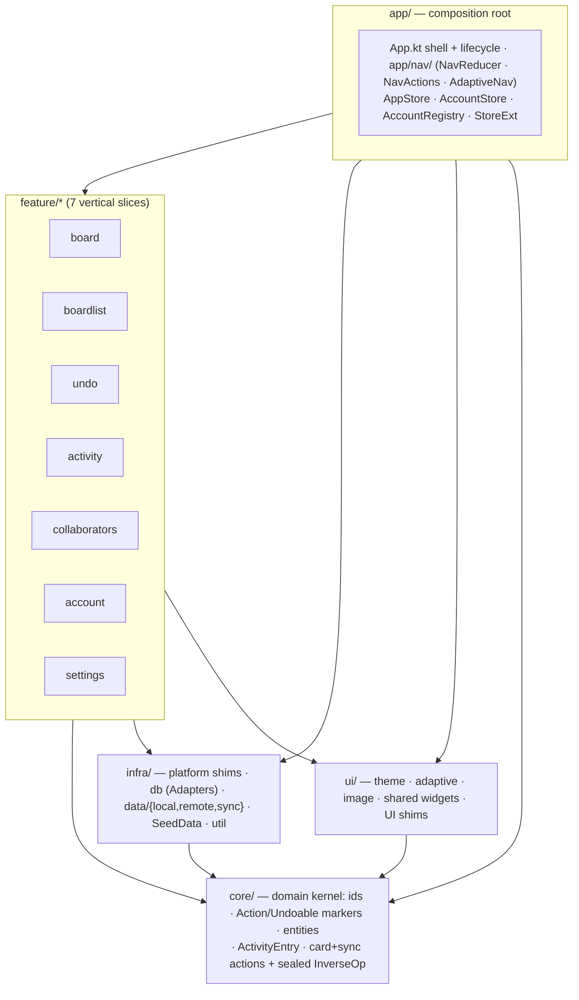

- **`core/`** is the domain kernel: ids (`core/Ids.kt`), the plain marker interfaces
  `Action`/`Undoable` (`core/Action.kt`), entities (`core/BoardEntities.kt`,
  `core/AccountEntities.kt`, `core/RootEntities.kt`), `core/ActivityEntry.kt`, and the
  card-mutation / sync actions plus the sealed `InverseOp` (`core/CardActions.kt`). It
  depends on nothing in the app.
- **`infra/`** depends only on `core`. It holds the platform `expect/actual` shims
  (`infra/platform/`), the SQLDelight adapters (`infra/db/Adapters.kt`; the generated
  SQLDelight code stays at package `…db`), the data/sync layer
  (`infra/data/{local,remote,sync}`), `infra/SeedData.kt`, and `infra/util/IdGenerator.kt`.
- **Each `feature/*`** owns its vertical slice (slot models · reducers ·
  effects/middleware · actions · selectors · UI) and may depend on `core`, `infra`, and
  `ui` — but not on other features (cross-feature wiring is the app's job).
- **`app/`** is the composition root: the `App()` shell, navigation (`app/nav/`), and the
  store composition (`app/AppStore.kt`, `app/AccountStore.kt`, `app/AccountRegistry.kt`,
  `app/StoreExt.kt`).

---

## 5. Layered architecture

The classic layers — **model · action · reducer · middleware · effect · UI** — are no
longer top-level packages. They now live **within each feature** (`feature/board` has its
own `BoardModels` · `BoardActions` · `BoardReducers` · `EffectsMiddleware` · `BoardScreen`,
etc.). The cross-cutting homes own the parts that don't belong to a single feature:
`core` (the shared domain kernel), `infra` (data/sync/db/platform), `ui` (theme + shared
widgets), and `app` (composition root + navigation). The diagram below is therefore a
**conceptual** layering of responsibilities, not a directory map; each box names where the
work lives by feature/package.

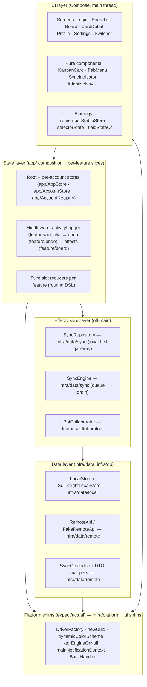

---

## 6. Store topology (two layers)

TaskFlow runs **N+1 stores**: one root store, plus one isolated store per logged-in
account, managed by `AccountRegistry`.

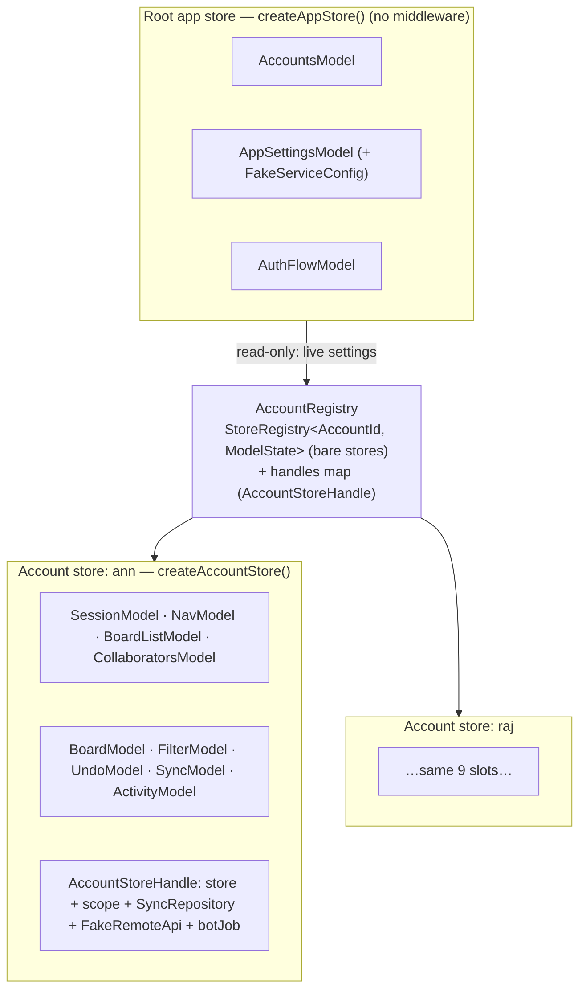

Key facts:

- `createAppStore()` — `app/AppStore.kt:45`. Root store; **no middleware**.
- `createAccountStore()` — `app/AccountStore.kt:136`. Per-account store behind the
  `activityLogger → undo → effects` middleware stack; constructs a per-account
  `FakeRemoteApi` + `SyncRepository` on a fresh `CoroutineScope(SupervisorJob() +
  Dispatchers.Default)`; returns an `AccountStoreHandle`.
- `AccountRegistry` — `app/AccountRegistry.kt:29`. Dual structure: a lock-free
  `StoreRegistry` holding the bare stores, plus a parallel `handles` map holding the
  disposable per-account resources. `remove(id)` cancels the bot + the whole scope
  (tearing down every effect/sync/bot coroutine) before forgetting both entries.
- **`ModelState` keys are immutable** (`ModelState.of(...)` locks the key set; `get`
  throws for an undeclared model). So both factories declare **all** slots up front, and
  "not loaded" is modelled as a nullable payload (`BoardModel.board == null`), never an
  absent slot.

---

## 7. State model catalog

### Root models (`createAppStore`)

| Model | Fields | Role |
|---|---|---|
| `AccountsModel` | `accounts: PersistentMap<AccountId, AccountSummary>`, `activeAccountId: AccountId?` | Global account directory + which account is active |
| `AppSettingsModel` | `theme: Theme`, `language: String`, `fakeService: FakeServiceConfig` | Live settings; every account store reads `fakeService` |
| `FakeServiceConfig` | `latencyMinMs=300`, `latencyMaxMs=800`, `failureRate=0.10`, `botEnabled=true`, `botIntervalMs=4000`, `online=true`, `syncIntervalMs=10000` | The demo "backend knobs" |
| `AuthFlowModel` | `mode: AuthMode`, `inFlight: Boolean`, `error: String?` | Login / add-account flow |

### Per-account models (`declareAccountModels`, `app/AccountStore.kt:193`)

| Model | Fields | Role |
|---|---|---|
| `SessionModel` | `accountId`, `bio: String?` | Session-only identity (name/avatar live in CollaboratorsModel) |
| `NavModel` | `stack: PersistentList<Route>` | Navigation stack (top = current screen) |
| `BoardListModel` | `boards: PersistentMap<BoardId, BoardSummary>`, `order: PersistentList<BoardId>` | The boards index |
| `CollaboratorsModel` | `byId: PersistentMap<AccountId, AccountSummary>` | Resolves assignee/creator/bot avatars without reaching into root |
| `BoardModel` | `board: Board?` | The open board; `null` = NotLoaded (reset by `BoardClosed`) |
| `FilterModel` | `query`, `assignee: AccountId?`, `labelIds: PersistentSet<LabelId>` | Board search/filter (reset by `BoardClosed`) |
| `UndoModel` | `past: PersistentList<Board>`, `future`, `cap=15` | Bounded whole-board undo/redo history |
| `SyncModel` | `inFlight: PersistentSet<CardId>`, `pendingCount`, `online`, `lastSyncedAt`, `lastError` | Sync projection; `inFlight` drives the per-card "Saving…" chip |
| `ActivityModel` | `entries: PersistentList<ActivityEntry>` (cap 50) | Humanized activity feed |

`Board` = `boardId` + `columns: PersistentList<Column>` + `cards: PersistentMap<CardId,
Card>`. All ids are `@JvmInline value class`es over `String` (`AccountId`, `BoardId`,
`ColumnId`, `CardId`, `LabelId`, `OpId`). Everything is deeply immutable
(`kotlinx.collections.immutable`).

---

## 8. Actions, reducers & the routing DSL

All actions implement `interface Action` (`core/Action.kt:7`). One orthogonal marker,
`interface Undoable` (`core/Action.kt:4`), is applied **only** to the four user card
mutations (`CardMoveRequested`, `AddCard`, `EditCard`, `DeleteCard`) — that is what
`undoMiddleware` keys off, so bot moves and async op-results never enter undo history.

> **Why plain (not `sealed`) markers.** Package-by-feature spreads the concrete action
> leaves across many packages (`core/CardActions.kt`, `app/nav/NavActions.kt`, and one
> `…Actions.kt` per feature), and a Kotlin `sealed` interface requires all subtypes in the
> same package/module-compilation unit. So `Action` and `Undoable` are **plain marker
> interfaces**. `InverseOp` (`core/CardActions.kt:50`) keeps its `sealed` modifier because
> all of its leaves live together in `core`.

Concrete actions, by home package:

| Actions | File |
|---|---|
| Card mutations + sync results + `InverseOp` (`CardMoveRequested`, `AddCard`, `EditCard`, `DeleteCard`, `BotMovedCard`, `BotAddedCard`, `CardOpSucceeded`, `CardOpFailed`, `SyncStatusChanged`, board load actions…) | `core/CardActions.kt` |
| Navigation (`Navigate`, `Back`, `EnterEditMode`, `OpenCard`, `CloseCard`, `StartCreateCard`, `CancelCreateCard`) | `app/nav/NavActions.kt` |
| Board feature (`AddColumn`, `Refresh`, filter actions…) | `feature/board/BoardActions.kt` |
| Board list (`LoadBoardListSucceeded`, `CreateBoard`…) | `feature/boardlist/BoardListActions.kt` |
| Account / auth (`AccountLoggedIn`, `SwitchAccount`, `LogoutAccount`, `LoadAccountsSucceeded`, `EditProfile`, login flow…) | `feature/account/AccountActions.kt` |
| Settings (`SetTheme`, `SetLatency`, `SetFailureRate`, `SetBotEnabled`, `SetOnline`…) | `feature/settings/SettingsActions.kt` |
| Undo (`Undo`, `Redo`, `PushUndo`, `SetUndoModel`…) | `feature/undo/UndoActions.kt` |
| Activity (`RecordActivity`) | `feature/activity/ActivityActions.kt` |

Reducers are pure `(model, action) -> model` functions registered per slot. The routing
DSL matches by **exact leaf class**; an unhandled action returns the *same* model instance
so the routing layer treats it as a no-op.

```kotlin
model(BoardModel()) {
    on<LoadBoardSucceeded> { s, a -> boardReducer(s, a, selfId) }
    on<CardMoveRequested>  { s, a -> boardReducer(s, a, selfId) }
    on<AddColumn>          { s, a -> boardReducer(s, a, selfId) }
    // …
}
```

### Action → reducer routing

| Slot | Reducer | Handles (exact leaf classes) |
|---|---|---|
| `AccountsModel` (root) | `accountsReducer` | `AccountLoggedIn`, `SwitchAccount`, `LogoutAccount`, `LoadAccountsSucceeded`, `EditProfile` |
| `AppSettingsModel` (root) | `appSettingsReducer` | `SetTheme`, `SetLatency`, `SetFailureRate`, `SetBotEnabled`, `SetOnline` |
| `AuthFlowModel` (root) | `authFlowReducer` | `StartLogin`, `LoginRequested`, `AccountLoggedIn`, `LoginFailed` |
| `SessionModel` | `sessionReducer` | `EditProfile` (bio only) |
| `NavModel` | `navReducer` | `Navigate`, `Back`, `EnterEditMode`, `OpenCard`, `CloseCard`, `StartCreateCard`, `CancelCreateCard` |
| `BoardListModel` | `boardListReducer` | `LoadBoardListSucceeded`, `CreateBoard` |
| `CollaboratorsModel` | `collaboratorsReducer` | `EditProfile` (self identity) |
| `BoardModel` | `boardReducer` | `LoadBoardSucceeded`, `BoardRestored`, `BoardClosed`, `CardMoveRequested`, `BotMovedCard`, `AddCard`, `BotAddedCard`, `AddColumn`, `EditCard`, `DeleteCard`, `CardOpFailed` |
| `FilterModel` | `filterReducer` | `SetFilterQuery`, `SetFilterAssignee`, `ToggleFilterLabel`, `BoardClosed` |
| `UndoModel` | `undoModelReducer` | `PushUndo`, `SetUndoModel`, `BoardClosed` |
| `SyncModel` | `syncReducer` | `CardMoveRequested`, `AddCard`, `EditCard`, `DeleteCard`, `CardOpSucceeded`, `CardOpFailed`, `SyncStatusChanged`, `BoardClosed` |
| `ActivityModel` | `activityReducer` | `RecordActivity` |

Notes:

- **`boardReducer` is integrity-preserving.** A move removes the card id from *every*
  column then re-inserts it once at a clamped index, so a stale `from` column cannot
  orphan or duplicate a card. Moves carry no clock and never touch `updatedAt`; all
  timestamps come from the action's pre-minted `now`.
- **`CardOpFailed` reverts via a per-op `InverseOp`** (`MoveBack` / `DeleteAdded` /
  `RestoreEdited` / `ReAddDeleted`) — not a whole-board snapshot.
- **`Undo`/`Redo` are not slot reducers.** They are intercepted by `undoMiddleware`,
  which runs the `undoReducer` helper (it needs the *present board*, which a slot reducer
  can't see) and re-dispatches `SetUndoModel` + `BoardRestored`.
- **Some actions fan out.** `EditProfile` hits three slots (root `AccountsModel`,
  per-account `SessionModel` bio, per-account `CollaboratorsModel` identity).
  `BoardClosed` resets four per-account slots (`BoardModel`, `FilterModel`, `SyncModel`,
  `UndoModel`) — but deliberately *not* `ActivityModel`.
- **Some actions have no reducer** (effect/middleware-only): `Refresh`,
  `LoadBoardRequested`, `LoadBoard*Failed`, `LoadBoardListRequested`, etc.

---

## 9. Navigation

`NavModel` is a **Route stack** (`stack: PersistentList<Route>`, default
`[Route.BoardList]`); the top of the stack is the current screen. Convenience getters
(`current`, `activeBoardId`, `openCardId`, `composing`) are derived from the stack so
older selectors keep working.

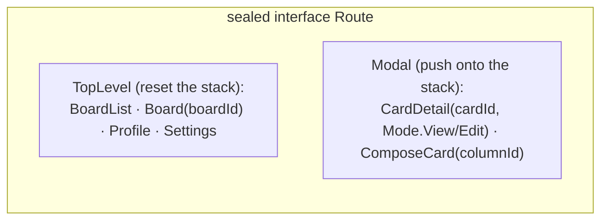

`navReducer` (`app/nav/NavReducer.kt:39`) rules:

- **Navigate to a `TopLevel`** resets the stack to a canonical base —
  `BoardList → [BoardList]`, `Board(id) → [BoardList, Board(id)]`,
  `Profile/Settings → [self]`.
- **Navigate to a modal** (`CardDetail`/`ComposeCard`) pushes (idempotent for the same
  card/column).
- **`EnterEditMode`** flips the top `CardDetail` to `Mode.Edit` in place.
- **`Back`** has an `Edit→View` special-case (flip, no pop), then pops one frame if
  `stack.size > 1`, else no-op (the host system-back exits the app).
- `OpenCard` / `CloseCard` / `StartCreateCard` / `CancelCreateCard` are domain aliases
  that forward to `Navigate` / `Back`.

The routing shell (`app/App.kt:241` `BoxWithConstraintsRouting`) computes
`background = stack.last { it is TopLevel }` and `overlay = current.takeIf { it !is
TopLevel }`, drawing the overlay in `key(overlay)` so per-card UI state resets across
swaps. `BackHandler` is an `expect/actual` wired only on Android (others are no-ops); the
in-app `Back` action is the canonical pop.

> **Status:** this stack-based model is the current on-disk implementation (a recent
> refactor from the flat `NavModel`). `EnterEditMode` is handled by `navReducer` and is now
> registered on the `NavModel` slot in `declareAccountModels` (`app/AccountStore.kt:201`).

---

## 10. Middleware pipeline & the optimistic dance

The **account store** is the only store with middleware. `applyMiddleware(activityLogger,
undo, effects)` runs in listed order on the way *down* to the reducer:

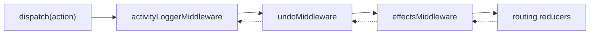

- **`activityLoggerMiddleware`** — pass-through observer. Forwards first, then (on the
  unwind) dispatches `RecordActivity` for recognized mutations, attributing the actor to
  `BOT_ACCOUNT_ID` for bot actions else `SessionModel.accountId`.
- **`undoMiddleware`** — on any `Undoable` action it dispatches `PushUndo(present board)`
  *before* forwarding; on `Undo`/`Redo` it intercepts (does not forward) and runs the
  `undoReducer` step.
- **`effectsMiddleware`** (`feature/board/EffectsMiddleware.kt:45`) — the innermost
  middleware and the **single dispatch-site for side effects**. It calls the reducer via
  `next(action)` then launches repository work.

### The optimistic-mutation dance

```mermaid
sequenceDiagram
  autonumber
  participant UI as Compose UI (main)
  participant ST as Account Store
  participant EM as effectsMiddleware
  participant SR as SyncRepository (off-main)
  participant DB as SQLDelight
  participant RA as FakeRemoteApi

  UI->>ST: dispatch(CardMoveRequested)
  Note over ST,EM: undoMiddleware dispatches PushUndo(pre-board)
  EM->>EM: present = board BEFORE next()
  EM->>ST: next(action) — boardReducer applies move optimistically
  EM->>SR: scope.launch { moveCard(..., inverse=MoveBack) }  (off-main)
  ST-->>UI: notify (optimistic move shown, card flagged "Saving…")
  SR->>DB: local.moveCard + enqueue(SyncOp)
  SR->>RA: SyncEngine.kick → push(op)
  alt Accepted
    RA-->>SR: PushResult.Accepted
    SR-->>EM: acceptEvents → CardOpSucceeded
    EM->>ST: dispatch(CardOpSucceeded) — clears inFlight
  else Rejected (e.g. WIP limit)
    RA-->>SR: PushResult.Rejected(reason)
    SR-->>EM: rejectEvents → CardOpFailed(inverse)
    EM->>ST: dispatch(CardOpFailed) — boardReducer applies inverse (revert)
  end
  ST-->>UI: notify (final state; "Saving…" cleared)
```

Effect handlers in `effectsMiddleware`:

| Action | Handler | What it does |
|---|---|---|
| `CardMoveRequested` | `onMove` | optimistic move; sync with `InverseOp.MoveBack` |
| `AddCard` | `onAdd` | reads materialized card back after `next()`; sync with `DeleteAdded` |
| `EditCard` | `onEdit` | captures `prev` before `next()`; sync with `RestoreEdited(prev)` |
| `DeleteCard` | `onDelete` | captures card+column before `next()`; sync with `ReAddDeleted` |
| `LoadBoardRequested` | `onLoadBoard` | loads from DB; dispatches `LoadBoardSucceeded` only if the user is still on that board (drops stale loads) |
| `LoadBoardListRequested` | `onLoadBoardList` | dispatches `LoadBoardListSucceeded` |
| `CreateBoard` | `onCreateBoard` | persists the board row + default To Do/Doing/Done columns |
| `AddColumn` | `onAddColumn` | persists the appended column at its sort index |
| `Refresh` / `SetOnline(true)` | inline | `scope.launch { syncRepo.refresh() }` |

On its first invocation `effectsMiddleware` launches three long-lived **collectors**
(`acceptEvents` → `CardOpSucceeded`, `rejectEvents` → `CardOpFailed`, `status` →
`SyncStatusChanged`). `createAccountStore` dispatches a benign `EffectsWarmUp` action at
construction so these collectors attach before the first real mutation.

---

## 11. Data, sync & persistence

TaskFlow is **local-first**: the SQLDelight DB is the durable source of truth; the network
is a replaceable seam that the `SyncEngine` drains asynchronously.

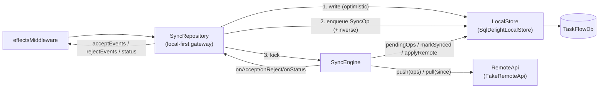

### The three-step mutation dance (`SyncRepository`)

For every `moveCard`/`addCard`/`editCard`/`deleteCard`:

1. **Write** the durable `LocalStore` (instant, works offline).
2. **Enqueue** a serializable `SyncOp` carrying a per-op `InverseOpDto` into the durable
   `pending_op` table (so a later rejection reconstructs the revert from the queued op
   alone).
3. **Kick** the `SyncEngine` to attempt a drain.

### `SyncEngine.drain` outcomes

| Push outcome | Engine action |
|---|---|
| `PushResult.Accepted` | `markSynced` (drop op) + `onAccept(CardOpSucceeded)` → clears `inFlight` |
| `PushResult.Rejected(reason)` | `onReject(CardOpFailed(inverse))` then `markSynced` (drop op; reverted via inverse, never retried) |
| `OfflineException` | stop the drain, queue intact, `online=false`, retry on reconnect |
| `TransientNetworkException` | `incrementAttempts`, keep the op queued, continue |

After a drain that pushed ≥1 op while online, the engine `pull`s remote changes and
last-write-wins merges them into the local DB. Drains are serialized by a `Mutex`
(only one runs at a time per account); `onStatus` fires only on a real delta.

### FakeRemoteApi (the demo backend)

Holds an in-memory server snapshot seeded identically to the local DB (both consume
`SeedData`), plus a change-log for bot edits surfaced via `pull`. Each call reads the live
`FakeServiceConfig` so Settings changes apply immediately: `latencyMin/MaxMs` (jittered
`delay`), `failureRate` (random `TransientNetworkException`), `online`
(`OfflineException`). The only deterministic rejection is a move into a column at its
`wipLimit` — the seed sets the **Doing** column at-limit to make this reproducible.

### SQLDelight schema (`TaskFlowDb.sq`)

Tables: `account`, `app_settings` (single row), `account_nav`, `board`, `board_column`,
`card`, `attachment`, `label`, `card_label`, `activity`, `collaborator`, **`pending_op`**
(the outbound queue), `sync_meta` (per-account pull cursor). Value-class ids map to `TEXT`,
`Instant` to `INTEGER` epoch-millis, via `infra/db/Adapters.kt`. `selectBoardList` derives
`cardCount`/`doneCount` via SQL `LEFT JOIN`s so board tiles never recompute aggregates in
Kotlin.

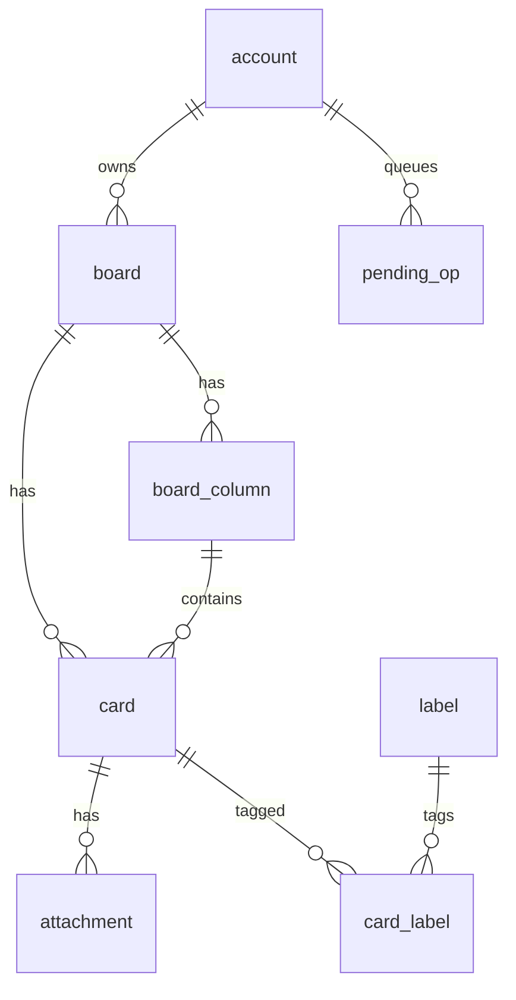

### Volatile UI persistence (`redux-kotlin-compose-saveable`)

Domain data and `activeAccountId` are durable in SQLDelight — the single source of truth.
The active account's *volatile* UI state (nav stack + board filter) persists across process
death via `redux-kotlin-compose-saveable`:

- A single `accountUiSaver: StateSaver<ModelState, UiSnapshot>` (`app/persistence/UiSnapshot.kt`)
  maps the relevant `ModelState` slots to a `@Parcelize` / `@Serializable` snapshot.
- `ActiveAccount` calls `accountStore.rememberSaveableState(accountUiSaver, key = "account-ui-<id>")`.
  The library restores the snapshot **synchronously during composition** (before the nav
  binding reads the stack), so the correct route is present on the first frame — no flash
  or one-frame-wrong-screen.
- Restore overlays the nav stack and filter via a `RestoreUiState` action routed onto those
  slots. `CardDetail` always restores in **View** mode (Edit is transient UI state, Rule C).
- The new-card draft survives via plain `rememberSaveable` (Compose-local, no store
  involvement — Rule C).
- `AppShell` gates the first paint behind a `booted` flag until the account directory loads
  from SQLDelight, preventing a Login-screen flash for returning users. `activeAccountId` is
  read via `fieldStateOf` (lock-free, lag-free).
- Subscriber callbacks use `coalescingNotificationContext` (inline when already on main,
  otherwise posts to main) so bindings never lag a dispatch.

---

## 12. The bot collaborator

`BotCollaborator` simulates an external teammate. `startBot`
(`feature/collaborators/BotCollaborator.kt:37`) launches a single cancellable coroutine on
the per-account scope:

```kotlin
scope.launch {
    while (isActive) {
        delay(settings().botIntervalMs)        // reads live settings each tick
        nextBotMove(store, settings(), rng)?.let { store.dispatch(it) }
    }
}
```

It picks a non-terminal column with cards and advances one card to the next column,
dispatching **`BotMovedCard`** (not `Undoable`, so it never enters user undo history, and
it triggers no sync — it represents server truth). The bot is started/stopped by
`AccountRegistry.startBot/stopBot`, driven by `app/App.kt`'s `BoardLifecycleEffect` (start on
board open, stop on dispose). Defaults: every 4 s, toggleable via Settings.

> `BotAddedCard` is fully wired (action + reducer + activity attribution) but the current
> bot only ever emits `BotMovedCard`.

---

## 13. UI / Compose binding & render isolation

The UI is a showcase for **render isolation ("Rule C")**: no composable selects the board,
its cards, or its columns wholesale. Each screen wraps its store via
`rememberStableStore(store).value`, then binds the smallest slices:

- `fieldStateOf(M::class) { slice }` — a typed single-model slice.
- `selectorState { ms -> derived }` — a cross-model derivation that recomposes only when
  the **value-equal** result changes.

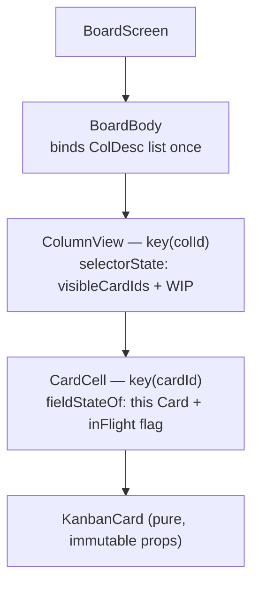

Because each column is `key(colId)` and each card is `key(cardId)`, moving one card
recomposes only the two affected columns. All list work (`deriveVisibleCardIds`, WIP
counts, column-neighbor walking) lives in pure functions in
`feature/board/BoardSelectors.kt` called
from `selectorState{}` — never `.filter`/`.count` in a composable body. Leaf components are
pure-presentational: finished `@Stable` data + remembered callbacks, no store access. Ids
and timestamps are minted at the dispatch site from `LocalIdGenerator`/`LocalClock`
CompositionLocals ("Rule G").

### Screen inventory

| Screen | Binds | Store |
|---|---|---|
| `LoginScreen` | `AuthFlowModel` (+ settings latency) | root |
| `SwitcherScreen` | `AccountsModel` (+ each account's `NavModel.current` for status lines) | root |
| `BoardListScreen` | `BoardListModel` | account |
| `BoardScreen` | per-column/per-card slices (see above) | account |
| `CardDetailScreen` | `NavModel.current` + one `Card` + column position | account |
| `ProfileScreen` | `SessionModel` + `CollaboratorsModel` + `BoardListModel` | account **and** root |
| `SettingsScreen` | `AppSettingsModel.theme` + `.fakeService` | root |

### Adaptive layout

`WindowSizeClass` breakpoints (Compact < 600 dp, Medium 600–840, Expanded ≥ 840):
`AdaptiveNav` shows a bottom `NavigationBar` (Compact) vs a `NavigationRail` (Medium/
Expanded); the board pages single columns in a `HorizontalPager` (Compact) vs a
side-by-side scrolling `Row` (Medium/Expanded) with an Activity rail pinned at Expanded;
`CardDetail` is full-screen (Compact) vs a 330 dp side sheet (Medium/Expanded).

---

## 14. Threading & concurrency model

This is the part most worth understanding. There is **no dedicated store thread**.
Concurrency is governed by the `CallerSerializedStore` lock plus a per-platform
`NotificationContext`.

### 14.1 The concurrent store contract (`redux-kotlin-concurrent`)

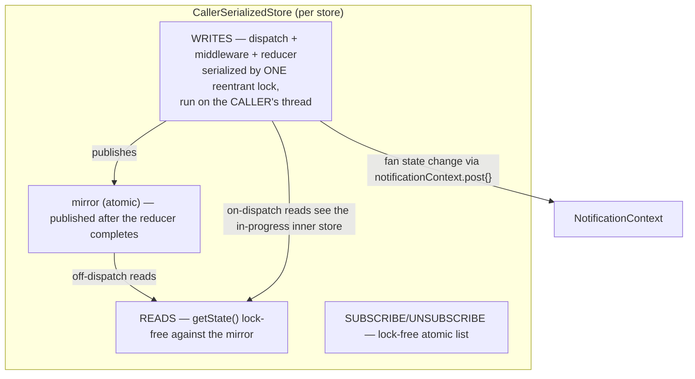

- **Writes** (`dispatch` → middleware → reducer) run inside `synchronized(lock) { … }` on
  whatever thread called `dispatch`. The lock makes interleaved dispatches from different
  threads safe and strictly serial — reducers **never** run concurrently for a given
  store, though they are genuinely invoked from multiple threads over the store's life
  (so they must be pure and touch no thread-affine state).
- **Reads** (`getState`) are lock-free: off-dispatch reads hit the atomic `mirror`
  (eventually consistent — published when the reducer completes); reads made *during* a
  dispatch on the dispatching thread see the in-progress inner store (a per-thread
  reentrant depth flag, `DispatchContext`, routes this).
- **Notifications** are routed through `notificationContext.post {}` rather than called
  inline.

### 14.2 NotificationContext — the thread boundary

Both stores are created with `mainNotificationContext()`, so **subscriber callbacks — the
Compose `selectorState`/`fieldState` writes that schedule recomposition — are marshalled to
the UI main thread on every platform**, regardless of which thread dispatched.

| Platform | `mainNotificationContext()` actual |
|---|---|
| Android | `Handler(Looper.getMainLooper()).post(block)` |
| iOS | `dispatch_async(dispatch_get_main_queue()) { block() }` |
| JVM (desktop) | Swing EDT — inline if already on EDT, else `SwingUtilities.invokeLater` |
| wasmJs | inline (single-threaded JS runtime) |
| Tests | `NotificationContext.Inline` — synchronous on the dispatching thread under virtual time |

This is the engine behind **"Rule E"**: all repository/sync/bot work runs **off-main** on
the account scope; those coroutines call `store.dispatch(...)` from a background thread
(the reducer runs there under the writer lock), and the marshal back to main happens
automatically at the notification boundary — **no effect handler needs an explicit main
hop**.

### 14.3 Per-operation thread ownership

| Operation | Thread / dispatcher | Serialization |
|---|---|---|
| `dispatch` + middleware + reducer | the **caller's** thread (UI main for user intents; `Dispatchers.Default` for effect/sync/bot/collector dispatches) | one reentrant lock per store — fully serial, never concurrent |
| `getState` reads | any thread, **lock-free** (atomic mirror) | none |
| Subscriber notify → Compose `State` write → recomposition | platform **UI main thread** | via `NotificationContext.post` |
| Effect repository work (`moveCard`/`addCard`/…) | per-account scope = `SupervisorJob() + Dispatchers.Default` (**off-main**) | per-coroutine |
| `SyncEngine.drain` (push/pull/merge) | per-account scope (Default) | **`Mutex` `drainLock`** — one drain at a time per account |
| SQLDelight reads/writes — Android/iOS/JVM | the **calling coroutine** (account scope, or the main composition coroutine for bootstrap reads) — synchronous driver, no thread hop | `db.transaction {}` for multi-row atomicity |
| SQLDelight reads/writes — wasmJs | offloaded to the **sql.js Web Worker** thread, awaited from the single JS thread | worker-serialized |
| Network latency / push / pull (`FakeRemoteApi`) | per-account scope; `delay(...)` **suspends** the coroutine (no thread block) | — |
| Bot loop | a single coroutine on the per-account scope (Default) | — |
| accept/reject/status collectors | 3 coroutines on the per-account scope (Default) | — |
| Periodic sync tick + bootstrap DB reads | the **main composition coroutine** (`LaunchedEffect` / `produceState`) | — |

### 14.4 Threads in one picture

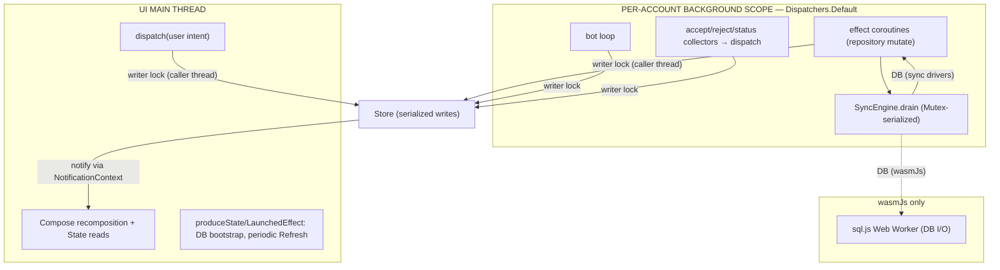

### 14.5 Lifecycle & teardown

A per-account scope is created fresh by `createAccountStore` and **cancelled** by
`AccountRegistry.remove(id)` (on logout) — which cancels the bot job and the whole scope,
tearing down every effect/sync/bot/collector coroutine. The replaying `acceptFlow`/
`rejectFlow` (`replay = 16`) ensure an event emitted before a collector attaches is not
lost.

---

## 15. Platform shims (expect/actual)

Six `expect` symbols isolate platform differences; everything else is shared. Five live in
`infra/platform/` (`DriverFactory`, `newUuid`, `dynamicColorScheme`, `ktorEngineOrNull`,
`mainNotificationContext`); the Compose-facing `BackHandler` lives in `ui/BackHandler.kt`
(with the other UI shims `ui/Locals.kt`, `ui/SystemBarAppearance.kt`).

| Shim | commonMain | Android | iOS | JVM | wasmJs |
|---|---|---|---|---|---|
| `DriverFactory.createDriver()` | `suspend` → `SqlDriver` | `AndroidSqliteDriver` (file) | `NativeSqliteDriver` | `JdbcSqliteDriver` (per-OS data dir) | `WebWorkerDriver` (sql.js worker, async schema) |
| `newUuid()` | `String` | `UUID.randomUUID()` | `NSUUID` | `UUID.randomUUID()` | `crypto.randomUUID()` |
| `dynamicColorScheme(dark)` | `ColorScheme?` | Material You (API 31+) | `null` | `null` | `null` |
| `ktorEngineOrNull()` | engine factory? (Coil) | `Android` | `Darwin` | `Java` | `null` (browser fetch) |
| `mainNotificationContext()` | `NotificationContext` | main `Looper` | main queue | Swing EDT | inline |
| `BackHandler(enabled,onBack)` | `@Composable` | `androidx.activity.compose.BackHandler` | no-op | no-op | no-op |

`DriverFactory.createDriver()` is `suspend` because the wasmJs worker applies the schema
asynchronously; the synchronous drivers apply it inline. `BackHandler` is functional only
on Android; on other hosts the in-app `Back`/Close actions are the back affordance.

---

## 16. App bootstrap sequence

```mermaid
sequenceDiagram
  autonumber
  participant HOST as Platform host
  participant APP as App()
  participant DF as DriverFactory
  participant LS as SqlDelightLocalStore
  participant ROOT as Root store
  participant REG as AccountRegistry

  HOST->>APP: boot (setContent / Window / ComposeViewport / UIViewController)
  APP->>APP: initCoil(); remember { createAppStore() }
  APP->>DF: produceState { createDriver() }  (suspend, off-main)
  DF-->>LS: SqlDelightLocalStore(taskFlowDb(driver))
  Note over APP: shows splash until LocalStore ready
  APP->>LS: LaunchedEffect: ensureSeeded(); loadActiveAccountId(); loadAccounts()
  APP->>ROOT: dispatch(LoadAccountsSucceeded(...))
  alt activeAccountId == null
    APP->>APP: render LoginScreen
  else active account present
    APP->>REG: getOrCreate(activeId) → AccountStoreHandle
    APP->>APP: render ActiveAccount → routed screen
  end
```

---

## 17. Design rules

The codebase follows a small set of named conventions (referenced throughout the source):

- **Rule C — Render isolation.** No composable reads the board/cards/columns wholesale;
  every leaf binds the narrowest slice via `selectorState`/`fieldStateOf` and is wrapped
  in `key(...)`. All list derivation lives in pure functions/reducers.
- **Rule D — Identity split.** A profile edit fans `EditProfile` to the root account
  directory, the per-account `CollaboratorsModel`, and `SessionModel` (bio) so identity is
  never duplicated inconsistently.
- **Rule E — Off-main effects.** All repository/sync/bot work runs off-main; dispatch
  marshals notifications back to main via `NotificationContext` (no explicit main hop in
  effects). The effect dispatch-site is `effectsMiddleware`
  (`feature/board/EffectsMiddleware.kt`); the sync layer lives in `infra/data/sync`.
- **Rule F — Delta-only status.** `SyncEngine` (`infra/data/sync/SyncEngine.kt`) emits
  `onStatus` only on a real `SyncStatus` change.
- **Rule G — Mint at the edge.** Ids and timestamps come from the `LocalIdGenerator`/
  `LocalClock` CompositionLocals (`ui/Locals.kt`; `IdGenerator` itself in
  `infra/util/IdGenerator.kt`) at the dispatch site, never from a reducer.
- **Rule H — Single inset point.** Window insets are applied once at the shell root.

Persistence (`LocalStore`) and network (`RemoteApi`) are deliberately separate seams.
Models are deeply immutable. The `ModelState` key set is fixed at construction (no runtime
inject/eject) — "not loaded" is a nullable payload, not an absent slot.

---

## 18. Testing strategy

- **`commonTest`** — platform-uniform correctness: reducer purity/integrity
  (`BoardReducersTest`, covering `feature/board`), action shape (`ActionsTest`, covering
  `feature/board`), sync-op codec (`SyncOpCodecTest`, covering `infra/data`), fake backend
  (`FakeRemoteApiTest`, covering `infra/data`).
- **`jvmTest`** — JVM-driver and integration tests: `LocalStoreTest` (SQLDelight
  round-trips on the JDBC driver, covering `infra/data`), `SyncEngineTest` (drain outcomes,
  `infra/data`), `OfflineSyncE2ETest` (the real store + middleware + sync wiring across
  offline/reconnect/reject under virtual time with `NotificationContext.Inline`, exercising
  `infra/data` + the feature middleware), plus Compose UI tests (render isolation, account
  switching).
- Native/iOS-simulator and browser test execution is host/CI-gated; local verification
  uses scoped `jvmTest` + cross-target compiles + `detektAll`.

---

*Generated from a structured read of `examples/taskflow/` (Kotlin 2.3.20, Compose-MP
1.11.0). Component references use `path:line` against the current working tree.*
