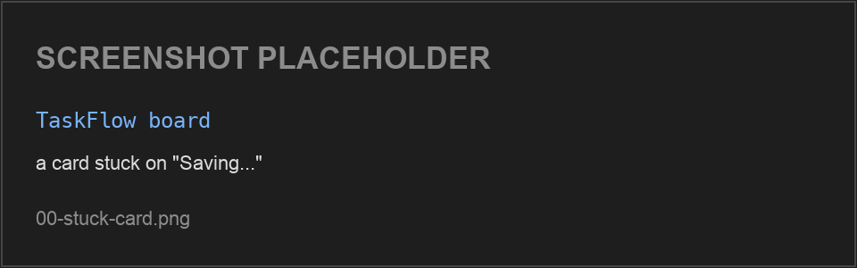
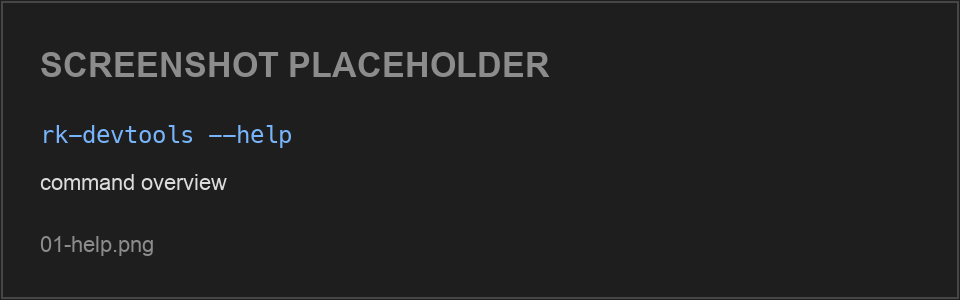
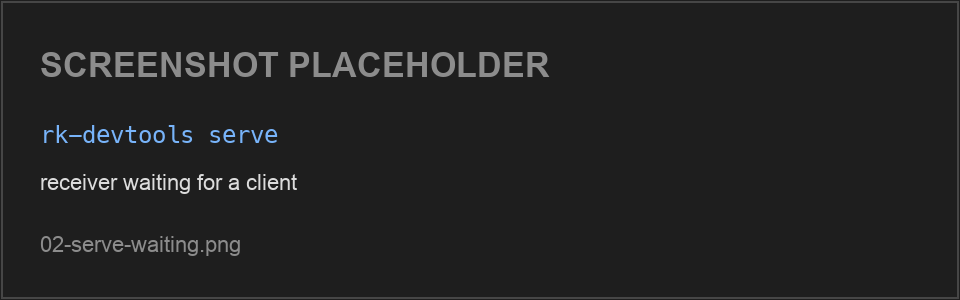
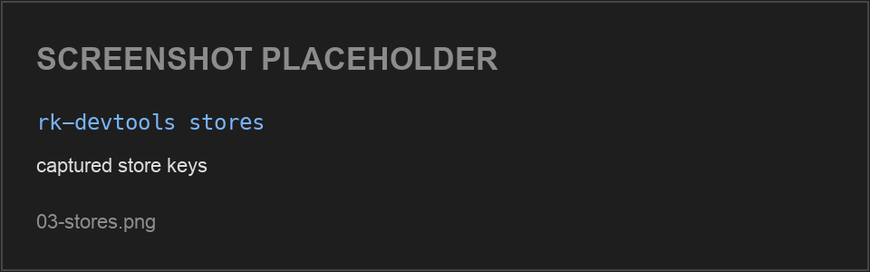
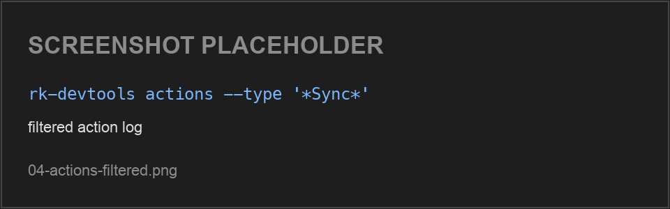
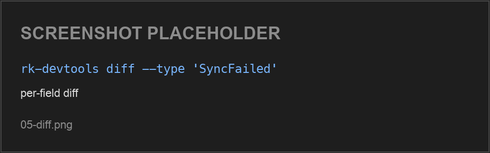
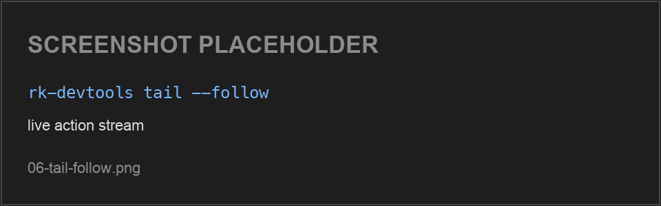

# How-to: Debug a running app with `rk devtools`

This walkthrough takes you end to end with the [DevTools CLI](./DevTools.md#the-rk-cli):
build the tool, point a running app at it, reproduce a bug, and pin down the
exact action and state change that caused it — all from the terminal, no
browser extension, no IDE debugger.

The CLI is **headless and scriptable**, which makes it the right tool for:

- debugging on devices/targets without a browser DevTools extension (iOS,
  Desktop, Wasm, CI),
- capturing a reproducible `.jsonl` trace to attach to a bug report,
- letting an AI agent or script answer "what fired before the crash?" — see
  the [agent walkthrough](https://github.com/reduxkotlin/redux-kotlin/blob/master/docs/agent/references/devtools.md).

:::caution Experimental
The DevTools modules are experimental and the CLI is an **unpublished**
developer tool — you build it from the repo, it is not a Maven artifact.
:::

> **Screenshots in this guide are placeholders.** Image slots reference
> the labelled placeholder PNGs in `./img/devtools-cli/`; replace them with real captures against the
> [TaskFlow sample](https://github.com/reduxkotlin/redux-kotlin/tree/master/examples/taskflow)
> when filling this page in.

---

## The scenario

We use the **TaskFlow** Kanban sample. TaskFlow does optimistic card moves
against a fake backend: a move applies immediately, then the server result
either confirms it (`CardOpSucceeded`) or rejects it and rolls back
(`CardOpFailed`). To make rejections happen on demand, open **Settings** and set
the **failure-rate** slider to 100%. Now every move you make snaps back. We'll
use the CLI to watch that optimistic-apply → reject → rollback trace and confirm
the in-flight bookkeeping behaves.



---

## Step 1 — Build the CLI

`rk` installs from the repo with Gradle's `installDist`:

```bash
./gradlew :redux-kotlin-cli:installDist

# resulting launcher:
redux-kotlin-cli/build/install/rk/bin/rk
```

Put it on your `PATH` for the session so the rest of the commands read cleanly:

```bash
export PATH="$PWD/redux-kotlin-cli/build/install/rk/bin:$PATH"
rk devtools --help
```

```text
Usage: rk devtools [<options>] <command> [<args>]...

Options:
  -h, --help  Show this message and exit

Commands:
  serve
  stores
  actions
  diff
  state
  tail
```

Run `rk devtools <command> --help` for a command's flags (e.g. `rk devtools actions --help`).



---

## Step 2 — Start the receiver

`rk devtools serve` hosts the bridge receiver on `127.0.0.1:9090` and writes one
`<storeKey>.jsonl` capture per store under `.rk-devtools/`. Leave it running in
its own terminal **before** you launch the app:

```bash
rk devtools serve
```

```text
serving bridge on 127.0.0.1:9090  -> captures in .rk-devtools
```

Useful flags: `--port`, `--host`, `--out <dir>`, `--token <t>` (required for
non-loopback binds), and `--ui` to also launch the desktop GUI monitor against
the same ingest.



---

## Step 3 — Point the app at the bridge

**TaskFlow already does this** — `AppStore.kt` / `AccountStore.kt` wire the
`devTools(...)` enhancer and attach a `BridgeOutput(BridgeConfig(clientId = "taskflow"))`
to the hub, pointing at `127.0.0.1:9090`. So you can skip straight to launching
the app.

For your **own** app, add a `BridgeOutput` to the DevTools hub in
**debug-only** code (the store must already carry the `devTools(...)` enhancer —
see [Wiring the store](./DevTools.md#wiring-the-store)):

```kotlin
import org.reduxkotlin.devtools.DevToolsHub
import org.reduxkotlin.devtools.bridge.BridgeConfig
import org.reduxkotlin.devtools.bridge.BridgeOutput

DevToolsHub.registerOutput(
    BridgeOutput(
        BridgeConfig(
            host = "127.0.0.1",
            port = 9090,
            startEnabled = true,
            clientLabel = "my-app",
        ),
    ),
)
```

Launch the app; `rk devtools serve` is already running. TaskFlow streams two stores — its
per-account board store and the root store. Once the app connects, captures begin appearing
under `.rk-devtools/`. Confirm with `rk devtools stores` (Step 4).

---

## Step 4 — List the captured stores

Move a card in the app (with failure-rate at 100% it'll snap back), then
confirm the CLI is recording:

```bash
rk devtools stores
```

```text
taskflow::TaskFlow      TaskFlow
taskflow::TaskFlow-root TaskFlow-root
```

(Each row is `<storeKey>` then the store's display name.)

The `clientId::storeInstanceId` key is what you pass to `--store` when more than
one store is captured (here `clientId = "taskflow"` and the instance id is each
store's `DevToolsConfig` name — `TaskFlow` for the board store, `TaskFlow-root`
for the root store). The board/card actions live in `taskflow::TaskFlow`. With a
single store, the query commands resolve it automatically.



---

## Step 5 — Scan the recent action log

```bash
rk devtools actions --store taskflow::TaskFlow --last 5
```

Output is **one JSON object per line** (pipe it to `jq`); `ts` is epoch millis:

```text
{"actionId":1,"type":"AddCard","store":"taskflow::TaskFlow","ts":1718450691120}
{"actionId":2,"type":"CardMoveRequested","store":"taskflow::TaskFlow","ts":1718450691402}
{"actionId":3,"type":"CardOpFailed","store":"taskflow::TaskFlow","ts":1718450692118}
{"actionId":4,"type":"CardMoveRequested","store":"taskflow::TaskFlow","ts":1718450692980}
{"actionId":5,"type":"CardOpFailed","store":"taskflow::TaskFlow","ts":1718450693640}
```

There's the pair we want: an optimistic `CardMoveRequested` at **2** and its
rejection `CardOpFailed` at **3**. Filter to just the card traffic with a type
glob:

```bash
rk devtools actions --store taskflow::TaskFlow --type '*Card*' --last 5
```



---

## Step 6 — Diff the offending action

`diff` shows the per-field JSON change each action produced. TaskFlow's state is
a `ModelState`, so the diff is keyed by model class. Look at what the rejection
did:

```bash
rk devtools diff --store taskflow::TaskFlow --since 3 --until 3 --pretty
```

The `diff` tier adds a `diff` array of `{op, path, before, after}` entries
(`--pretty` expands it; drop it for one object per line):

```json
{
    "actionId": 3,
    "type": "CardOpFailed",
    "store": "taskflow::TaskFlow",
    "ts": 1718450692118,
    "diff": [
        { "op": "CHANGED", "path": "SyncModel.inFlight", "before": ["card-7"], "after": [] },
        { "op": "ADDED", "path": "SyncModel.lastError", "before": null, "after": "card-7 rejected by backend" },
        { "op": "CHANGED", "path": "BoardModel.board.card-7-column", "before": "done", "after": "doing" }
    ]
}
```

The trace confirms the rollback is correct: `card-7` leaves `SyncModel.inFlight`
the moment the op resolves, `lastError` records why, and `BoardModel` reverts the
optimistic move via the action's inverse op. (Exact serialization depends on the
serializer tier — JVM renders structured JSON; other targets may render
`toString()`.)



---

## Step 7 — Confirm against full state

Print the full state snapshot at that action to confirm the post-rollback shape:

```bash
rk devtools state --store taskflow::TaskFlow --at 3 --pretty
```

`state` prints the whole serialized state at that action (a `ModelState`, keyed
by model class):

```json
{
    "SyncModel": {
        "online": true,
        "pendingCount": 0,
        "inFlight": [],
        "lastError": "card-7 rejected by backend"
    },
    "BoardModel": {
        "board": { "name": "Launch", "card-7-column": "doing" }
    }
}
```

`inFlight` is empty and `card-7` is back in its original column — the optimistic
move was cleanly reverted. If `inFlight` had retained `card-7`, that would be the
"stuck Saving…" bug to chase; here it's clean.

---

## Watching live: `tail --follow`

While iterating, stream actions as they fire instead of re-running `actions`:

```bash
rk devtools tail --follow
```

`--follow` polls the capture every 300ms and prints new actions (same JSON-line
format as `actions`). Combine with `--type` to watch only what you care about:

```bash
rk devtools tail --follow --type '*Card*'
```



---

## Other scenarios

| Goal | Command |
|---|---|
| Everything since a known-good action | `rk devtools actions --since 40` |
| A bounded window | `rk devtools actions --since 40 --until 50` |
| Only actions in a time window | `rk devtools actions --since-time 2026-06-15T12:04:00Z` |
| Full state + diff for every action | `rk devtools actions --format full --pretty` |
| One specific store when several are captured | `rk devtools diff --store 'taskflow::TaskFlow' --last 5` |
| Inspect captures with the GUI too | `rk devtools serve --ui` |

---

## Captures are just files

Each store is a plain `<storeKey>.jsonl` under `.rk-devtools/` — commit one to a
bug report, diff two runs, or decode it programmatically with the bridge codec
(`decodeRecording` / `decodeRecordingLenient`). See the
[bridge module](https://github.com/reduxkotlin/redux-kotlin/tree/master/redux-kotlin-devtools-bridge).

## See also

- [DevTools reference](./DevTools.md) — full module map, store wiring, in-app
  drawer, remote streaming, standalone monitor, security notes.
- [CLI README](https://github.com/reduxkotlin/redux-kotlin/tree/master/redux-kotlin-cli) —
  command/flag table.
- [Agent walkthrough](https://github.com/reduxkotlin/redux-kotlin/blob/master/docs/agent/references/devtools.md) —
  the same loop driven by an AI agent.
